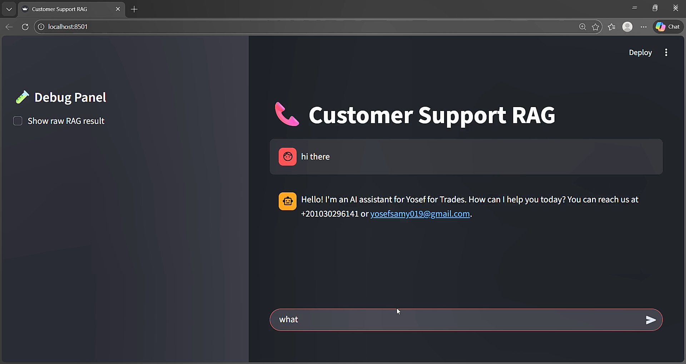
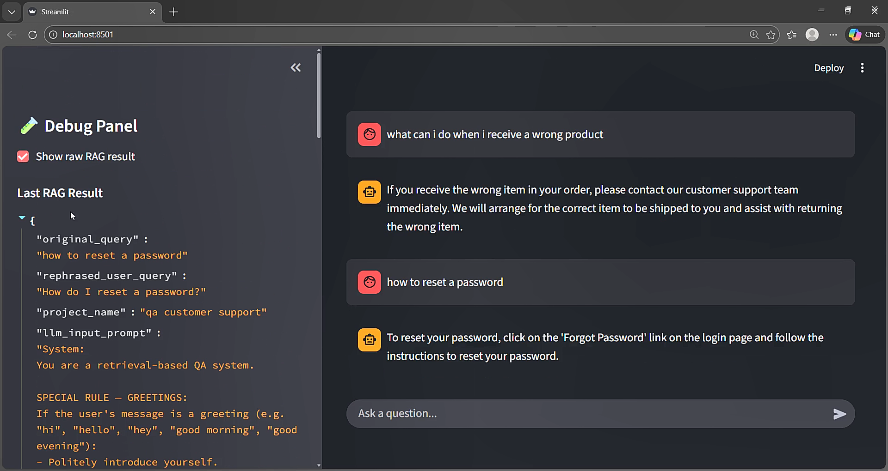
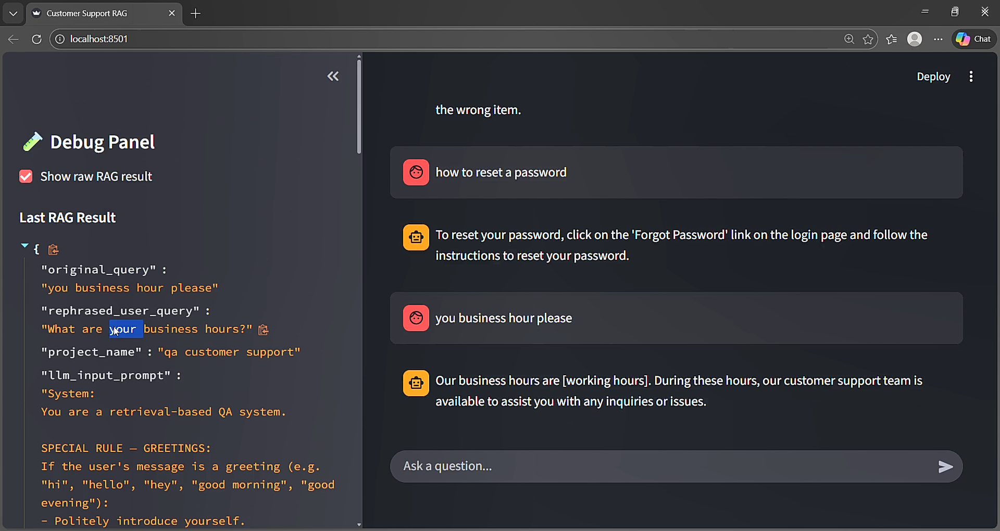
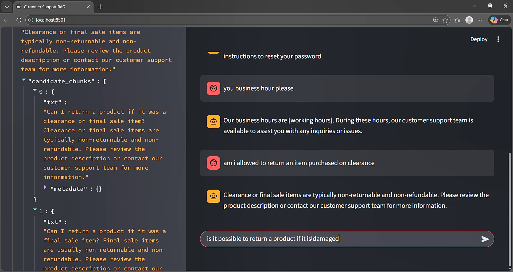
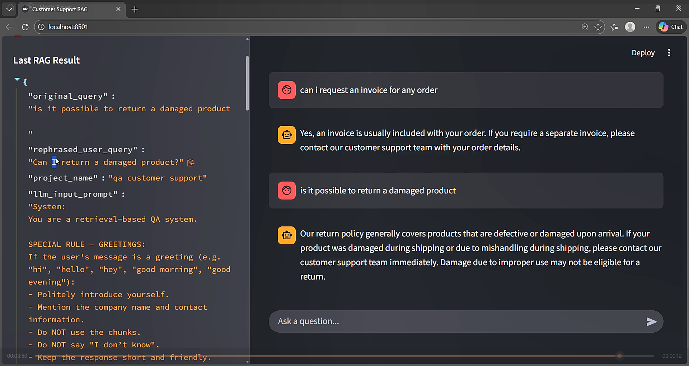

# Retrieval-Augmented Generation (RAG) Framework for Customer Support

A modular Python framework for **building retrieval-augmented AI systems**. This project provides tools for ingesting,
chunking, embedding, storing, and querying textual data with modern LLMs and vector databases.

## Features

* **Flexible Data Ingestion**

    * Supports text, JSON (question-answer format), and PDF files.
    * Converts structured and unstructured data into a unified text format.

* **Chunking System**

    * Word-based chunking with configurable window and overlap sizes.
    * Deduplication and metadata tracking for each chunk.
    * Handles both "no slicing" and fixed window approaches.

* **Vector Database Integration**

    * FAISS-based vector storage for fast similarity search.
    * Automatic cache saving and loading.
    * Filters duplicate chunks and supports top-k nearest neighbor search.

* **Embeddings and LLM Integration**

    * Generate embeddings with `AllMiniSentenceLLM` (mini sentence transformers).
    * Query understanding and intent rephrasing via `GeminiLLM`.
    * Batch processing of chunks for efficient embedding computation.

* **RAG Pipeline**

    * Add PDFs or JSON datasets directly to the project storage.
    * Retrieve candidate chunks based on query embeddings.
    * Answer user queries using a retrieval-based LLM with strict rules.
    * Maintains chat history and supports intent rephrasing for multi-turn conversations.

* **Templates System**

    * Customizable templates for query-answering and intent rephrasing.
    * Conditional company information injection.
    * Ensures precise, controlled responses from the LLM.

## Example Usage

```python
from src.controllers.rag_controller import RAGController
from src.models.project_model import Project

# Initialize a project
project = Project(project_name="MyRAGProject", vector_db_path="./vector_cache")

# Add PDF or JSON data
RAGController.storage_add_pdf(project, "docs/sample.pdf")
RAGController.storage_add_json(project, "data/qna.json")

# Query the system
response = RAGController.search_with_query(project, "What is the release year of Python?")
print(response["response"])
```

## Tech Stack

* Python 3.10+
* FAISS for vector search
* PyPDF2 for PDF ingestion
* Pandas & JSON for data processing
* TensorFlow/Keras for embedding models
* Google Gemini API for LLM-based query answering

## Project Structure

* **controllers/** – Core logic for ingestion, chunking, and RAG workflow.
* **database/** – Vector database interfaces (FAISS-based) and caching.
* **llm/** – Interfaces for sentence embeddings and seq2seq LLMs.
* **models/** – Data structures: Chunk, ChatMsg, Project, etc.
* **templates/** – Query answering and intent rephrasing templates.
* **helper/** – Utility functions (e.g., API calls).

## Images




